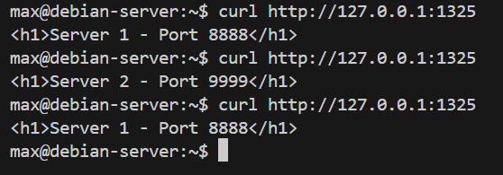
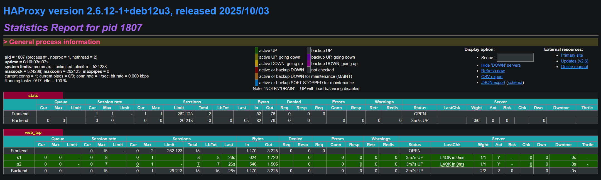
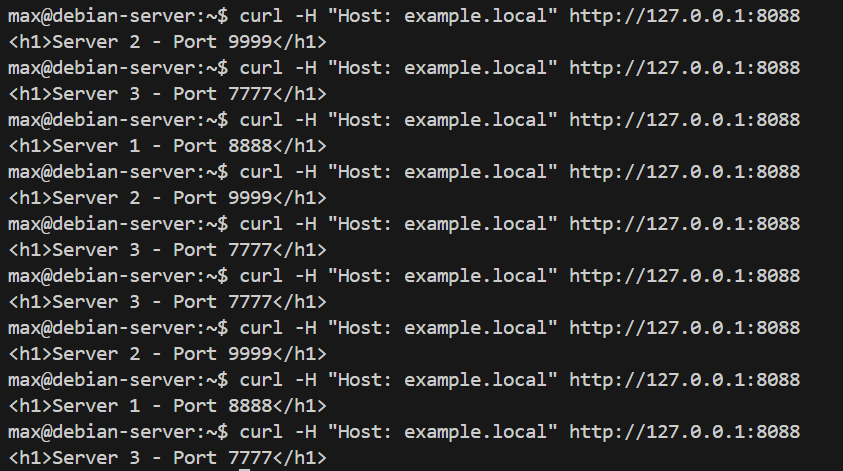
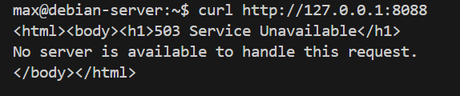
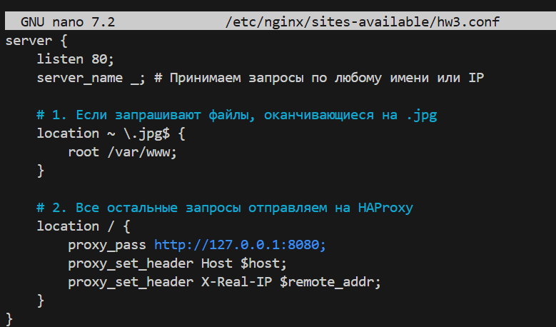
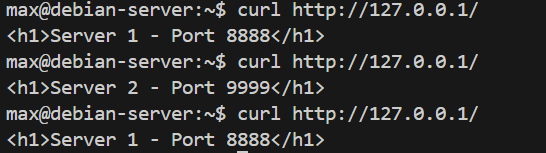
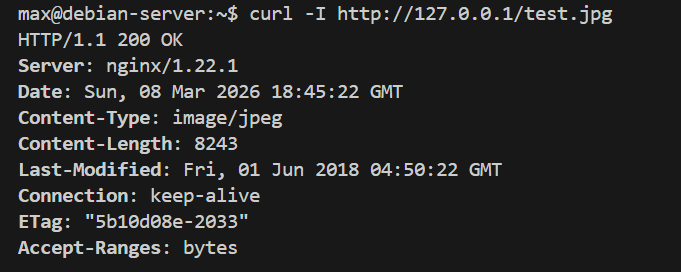
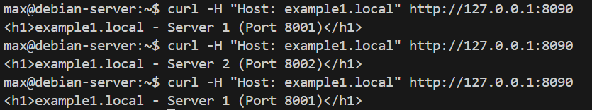
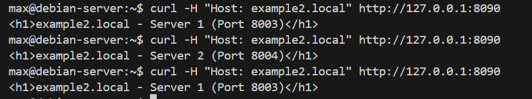

# Домашнее задания "Кластеризация и балансировка нагрузки" — Моськов Максим

### Задание 1:
[Конфигурационный файл HAProxy для Задания 1](./configs/haproxy_task1.cfg)

В блоке web_tcp:

1. Серверы s1 и s2 горят зеленым (UP).

2. В колонке Sessions -> Total ровно 15 сессий на фронтенде.

3. Балансировщик честно разделил их: 8 запросов ушло на первый сервер и 7 на второй.

### Задание 2:

[Конфигурационный файл HAProxy для Задания 2](./configs/haproxy_task2.cfg)

### С доменом

### Без домена

### Задание 3*:

[Конфигурационный файл HAProxy для Задания 3](./configs/haproxy_task3.cfg)

### Задание 4*:

[Конфигурационный файл HAProxy для Задания 4](./configs/haproxy_task4.cfg)

## Проверяем сайт example1.local:

## Проверяем сайт example2.local:

