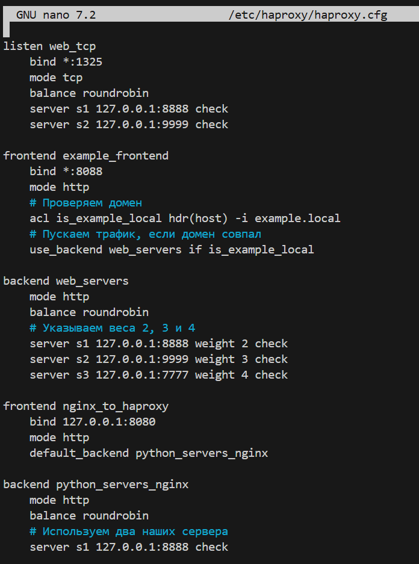

# Домашнее задания "Кластеризация и балансировка нагрузки" — Моськов Максим

### Задание 1:
[Конфигурационный файл HAProxy для Задания 1](./configs/haproxy_task1.cfg)

### Задание 2:

### С доменом

### Без домена

### Задание 3*:

### Задание 4*:

## Проверяем сайт example1.local:

## Проверяем сайт example2.local:

